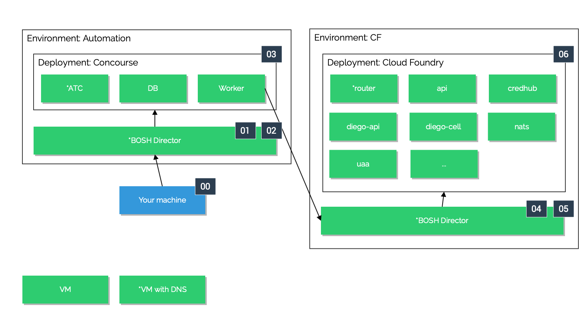

In this guide you will learn how to run and operate several projects that form the overall cloud platform you will build.
The following picture depicts an overview of the setup we describe here in this guide:

We will mainly focus on building two [environments](getting-started-environments.md): an *automation environment* leveraging Concourse to automate operational aspects, and one (or several) *Cloud Foundry environments* that host the platform and serve the apps.

Each environment consists of a BOSH director, which is the deployment orchestration tool used to spin up the whole environment.
While we can manually use BOSH to deploy things we want the BOSH deployments to be automatically run from our automation environment.
So in fact, the automation environment will be the only environment you will deploy manually.
However, keep in mind that the automation uses the exact same tools as you do in a manual deployment.

The number annotations in the image above highlight the order in which to deploy the different parts of the landscape.
In particular, the steps are:

- **00:** You will initiate the deployment from an existing machine. 
  In a production context, you would want to do this from a jumphost.
- **01:** First, roll out the BOSH director itself as described in [Deploying BOSH](bosh-deployment.md).
- **02:** Once the BOSH director is up and running, set the [Cloud Config](https://bosh.io/docs/update-cloud-config/) and [Runtime Config](https://bosh.io/docs/runtime-config/) according to the needs of your target deployment.
- **03:** Now that we have a BOSH director, it's time to [Deploy Concourse](concourse-deploying-concourse.md) for the automation environment.
- **04:** From a Concourse pipeline, [deploy the BOSH director](bosh-deployment.md) for a specific Cloud Foundry environment.
  In case you have multiple Cloud Foundry environments, you would set up one team per environment in Concourse and duplicate the pipelines accordingly.
- **05:** Add configuring the BOSH cloud and runtime config to the pipeline and adjust it for the Cloud Foundry deployment requirements.
- **06:** Deploy Cloud Foundry itself.

In this first chapter of the guide you will learn general concepts that apply to all environments.
The following chapters will teach you how to setup and configure each of the environments.